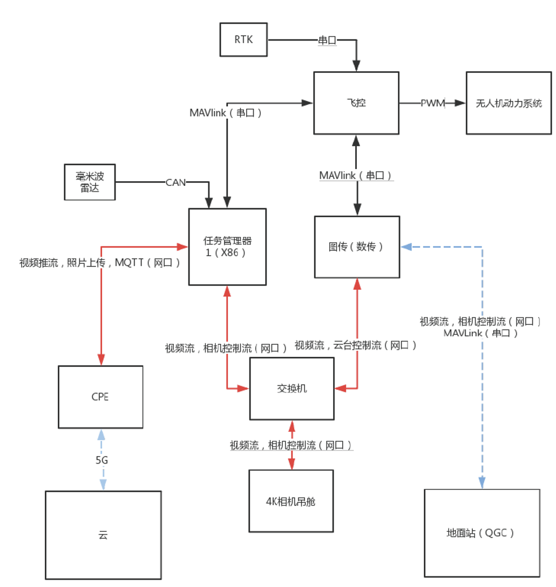

# 硬件框架结构
下图所示为产品的硬件结构示意图。

## 各硬件模块功能简介
> **任务管理器** 

通过5G CPE连网（也可以连接WIFI）。无人机的大脑，主要负责：云端控制无人机飞行（通过MQTT协议），
拍照并把照片上传到云端（通过FTP协议），通过OBS将相机的视频推流到用户指定的直播平台或者是自建的
服务器。

> **飞控（RST Phenix Mini）** 

主要负责控制无人机的动力系统从而实现一系列的飞行任务，
可以与地面站(QGC)通过数传模块进行MAVLink通信。任务管理器中可以先读取包含有航线航点信息的文件
然后告知飞控具体的飞行任务。

> **图数一体模块** 

图传用于向相机地面站传输实时图像以及控制相机，数传用于飞控以及地面站\(QGC\)之间的通信。

> **30倍4K高清相机** 

相机的功能有三部分： 
- 实时传输视频给相机地面站(QGC)，并可以通过地面站(QGC)控制相机
- 通过任务管理器的程序控制相机拍摄/发送照片到云端的FTP服务器
- 通过任务管理器上的OBS软件发送实时视频到任意直播平台

> **云** 

云服务器中包含一个MQTT服务器和一个FTP服务器。MQTT服务器用于与任务管理器通信以实现对无人机的
实时控制并获取无人机的实时状态信息。FTP服务器用于接收由机载计算机发出的照片。

> **地面站(QGC)** 

地面站包括飞控的地面站(QGroundControl)，和相机地面站GCS。
