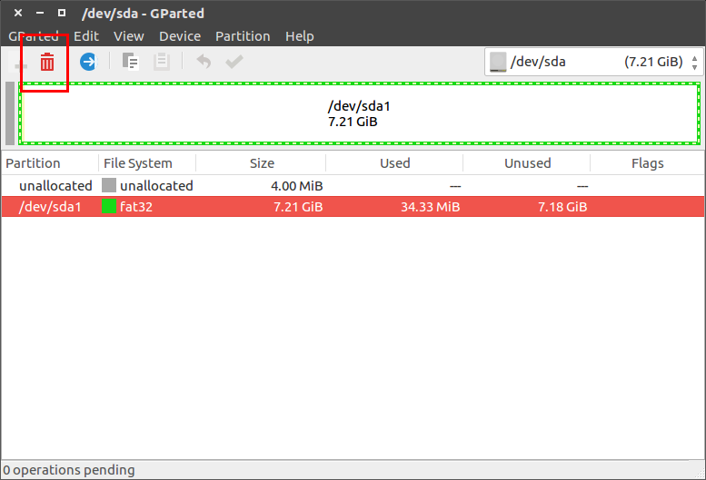
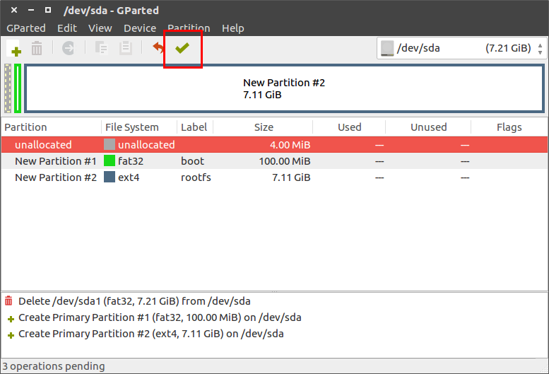

# 3.ROS Environment

This section will show you how to install ROS on devkit, please make sure you have understand the first two sections before read this one.

## 3.1 Install Ubuntu Core Rootfs

Robsense has built an ubuntu rootfs \(base on [http://cdimages.ubuntu.com/ubuntu-base/releases/16.04/release/ubuntu-base-16.04-core-armhf.tar.gz](http://cdimages.ubuntu.com/ubuntu-base/releases/16.04/release/ubuntu-base-16.04-core-armhf.tar.gz)\), you can find it at:

```text
PhenixPro_Devkit/amp_system/linux_images/ubuntu-core-16.04-robsense.tar.bz2
```

ubuntu core username: robsense

ubuntu core password: robsense

### 3.1.1 Partition SD Card

We use gparted to partiton sd card, which is easy to manage patition. Install it with apt:

```text
sudo apt-get install gparted
```

Umount SD card:

```text
umount /media/[PC username]/[sd label]
```

Open gparted, and select SD:


Select current fat32 parition, and delete it:



Create two new partiton:

First, fat32 partition, 200M, Primary Partition, Free space preceding is 4M, Label is "boot"


Second, ext4 partition, Primary Partition, Free space preceding is 0, Label is "rootfs"


Finish with button below



### 3.1.2 Install Rootfs To SD

Copy Boot.bin, uImage, devicetree.dtb to boot partition:

```text
cd PhenixPro_Devkit
cp BOOT.bin /media/[PC username]/boot/
cd amp_system/linux_images/
cp devicetree.dtb uImage /media/[PC username]/boot/
```

Extract rootfs to SD card:

```text
cd PhenixPro_Devkit/amp_system/linux_images
sudo tar -xpf ubuntu-core-16.04-robsense.tar.bz2 -C /media/[PC username]/rootfs
```

Umount SD card:

```text
umount /media/[PC username]/*
```

### 3.1.3 Configure u-boot

u-boot will default to load ramdisk, we need to tell it to stop load ramdisk:

```text
set sdboot 'if mmcinfo; then run uenvboot; echo Copying Linux from SD to RAM... && load mmc 0 ${kernel_load_address} ${kernel_images} && load mmc 0 ${devicetree_load_address} ${devicetree_images} && bootm ${kernel_load_address} - ${devicetree_load_address}; fi'
```

Tell it to load filesystem from sd card:

```text
set bootargs 'console=ttyPS0,115200 maxcpus=1 root=/dev/mmcblk0p2 rw earlyprintk rootfstype=ext4 rootwait devtmpfs.mount=0'
```

Boot system:


## 3.2 Install ROS Kinetic

### 3.2.1 Configure Network

```text
sudo vim /etc/network/interfaces
```

Add:

```text
auto eth0
iface eth0 inet static
address 192.168.0.234
gateway 192.168.0.1
netmask 255.255.255.0
dns-nameservers 114.114.114.114
```

Restart network:

```text
sudo ifdown eth0 && sudo ifup eth0
```

Test:

```text
ping www.baidu.com
```


### 3.2.2 Setup sources.list

```text
sudo sh -c 'echo "deb http://packages.ros.org/ros/ubuntu $(lsb_release -sc) main" > /etc/apt/sources.list.d/ros-latest.list'
```

### 3.2.3 Setup keys

```text
sudo apt-key adv --keyserver hkp://ha.pool.sks-keyservers.net:80 --recv-key 421C365BD9FF1F717815A3895523BAEEB01FA116
```

### 3.2.4 Installation

Update Ubuntu repositories:

```text
sudo apt-get update
```

Install Ros-Base:

```text
sudo apt-get install ros-kinetic-ros-base
```


### 3.2.5 Initialize rosdep

```text
sudo rosdep init
rosdep update
```

### 3.2.6 Environment setup

```text
echo "source /opt/ros/kinetic/setup.bash" >> ~/.bashrc
source ~/.bashrc
```

### 3.2.7 Getting rosinstall

[rosinstall](http://wiki.ros.org/rosinstall) is a frequently used command-line tool in ROS that is distributed separately. It enables you to easily download many source trees for ROS packages with one command.

```text
sudo apt-get install python-rosinstall
```

### 3.2.8 Check

```text
printenv | grep ROS
```


## 3.3 Wakeup CPU1

Insert SD card to PC, copy binary tools to ubuntu core user home:

```text
sudo cp linux/ocm_master/ocmfs_master /media/[PC username]/rootfs/home/robsense
sudo cp linux/pilot_cmd/pilot_cmd /media/[PC username]/rootfs/home/robsense
sudo cp linux/rwmem/rwmem.elf /media/[PC username]/rootfs/home/robsense
```

Modify .bashrc:

```text
sudo vim /media/[PC username]/rootfs/home/robsense/.bashrc
```

Add

```text
echo "robsense" | sudo -S ./ocmfs_master &
echo "robsense" | sudo -S ./rwmem.elf  0xfffffff0 0x1a000000
```

Insert SD card to devkit, and power on:


